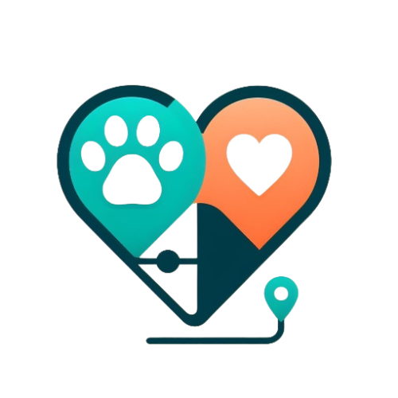

# PET Match

## Descrição
O **PET Match** é um aplicativo desenvolvido pelo Grupo 8 de UPX V com o objetivo de facilitar a adoção de animais e o reporte de animais perdidos. Com diversas funcionalidades e uma interface amigável, o aplicativo oferece uma plataforma para conectar pessoas que desejam adotar um pet com animais que estão disponíveis para adoção, além de possibilitar o registro e visualização de animais desaparecidos.

## Funcionalidades

### Página Inicial
A página inicial apresenta o **PET Match** e convida os usuários a explorar os serviços oferecidos pelo aplicativo, como adoção e reporte de animais perdidos.

### Grupo UPX
Uma página dedicada à apresentação do Grupo 8 de UPX V, responsável pelo desenvolvimento do aplicativo. Apresenta informações sobre os membros do grupo e uma breve descrição do projeto.

### Mapa de Pets Desaparecidos
Nesta página, os usuários podem visualizar uma seleção de fotos de animais desaparecidos e contribuir com informações caso tenham visto algum deles.

### Match com Seu Pet
Uma funcionalidade divertida que permite aos usuários "deslizarem" para a direita se estiverem interessados em adotar um animal exibido na tela, ou para a esquerda se desejarem ver outro pet. Quando ocorre um "match", o usuário é notificado.

### Registro de Pets Desaparecidos
Os usuários podem registrar animais desaparecidos, fornecendo informações como tipo de animal, raça, cor, localização e descrição, além de anexar uma foto do animal. Os registros podem ser visualizados posteriormente na seção de relatórios.

### Relatório de Animais Desaparecidos
Uma seção onde os usuários podem visualizar relatórios anteriores de animais desaparecidos registrados por outros usuários, incluindo informações detalhadas e, quando disponíveis, fotos dos animais.

---
Este projeto foi desenvolvido pelo Grupo 8 de UPX V como parte de um esforço para promover a adoção responsável de animais e ajudar na busca por animais perdidos. Se você está procurando um novo amigo peludo ou deseja ajudar a encontrar animais desaparecidos, o **PET Match** está aqui para ajudar! 🐾
